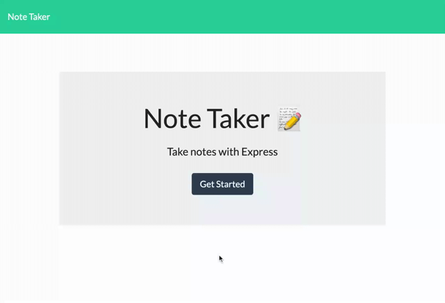

# note-taker

Note Taker can be used to write, save and delete notes. This application will use an Express.js back end and will save and retrieve note data from a JSON file.

## Built With
* Node.js
* Express
* JavaScript

## Installation
* Download or clone repository
* Node.js is required to run the application
* `npm install `to install the required npm packages

## Usage
You can use the application via either options:
* Live website: [Heroku](https://young-retreat-21388.herokuapp.com/)
* Open your browser and go to
```
http://localhost:3001/
```

## Demo
